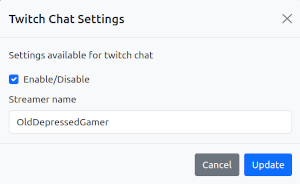

# Adminpage
## Outgoing channel : none
- [Adminpage](#adminpage)
  - [Outgoing channel : none](#outgoing-channel--none)
  - [Purpose](#purpose)
  - [Usage](#usage)
  - [Funcionality](#funcionality)
  - [Extension Developer information](#extension-developer-information)
    - [Message formats](#message-formats)
    - [Request for your modal](#request-for-your-modal)
    - [Responce to a modal request](#responce-to-a-modal-request)
    - [Data returned from a modal submit](#data-returned-from-a-modal-submit)
  - [Example modal code](#example-modal-code)
    - [Description of the example](#description-of-the-example)
      - [Title](#title)
      - [Description](#description)
      - [Hidden fields](#hidden-fields)
      - [Extension data](#extension-data)

The admin page extension is designed to display various information about the system and all control/settings to be issues to extensions in use
## Purpose
To allow configuration of the extensions/backend and to show the status of the sytem.
## Usage
Open a webbrowser on the server (normally localhost:3000)

## Funcionality
1) Sets credentials for the extensions (ie security keys, passwords etc)
2) Display StreamRoller messages from the system being sent received so you can monitor if something appears to be missing
3) Display a list of extensions loaded and running (currently only the ones started by the server)
4) Display a list of all channels created
5) Loads code from extensions and added as a link to the extension name in the extension list
6) Posts any data submitted on the extension form loaded (by clicking the link in 5) and submits it back to the extension

## Extension Developer information
### Message formats
If you want your extension to appear on the Admin page via the extension links you can provide this via bootstrap modal code.

### Request for your modal

During the admin page loading it will send out a message on the system requesting the modal. The message will be of the format

```
{
    type: "ExtensionMessage",
    from: "adminmodalpage",
    data:
    {
        type: "RequestAdminModalCode"
        from :"adminmodalpage"
    } 
}
```
### Responce to a modal request
To send code back use the following message structure.
Note that you should add the 'destination extension name'
```
sr_api.sendMessage
    (
    <your socket handle>,
    sr_api.ServerPacket
        (
        "ExtensionMessage",
        <your extension name>,
        sr_api.ExtensionPacket
            (
            "AdminModalCode",
             <your extension name>,
             {<modalstring>},
             "",
             <destination extension name>,,
             <your channel name>,
            ),
        "",
        <destination extension name>
        )
    )
```
for clarity (without the code) the packet looks like
```
{
    type: "ExtensionMessage",
    from: <your extension name>,
    data: 
    {
        "AdminModalCode",
        <your extension name>,
        {<modalstring>},
        "",
        <destination extension name>,,
        <your channel name>,
    },
    dest_channel: "",
    to: <destination extension name>
}
```

### Data returned from a modal submit


```
{
    type: "ExtensionMessage",
    from: "adminmodalpage",
    data:
    {
        type: "AdminModalData",
        from: "adminmodalpage",
        data: 
        {
            <modal data>
        },
        dest_channel : "",
        to : <your extension name>
    },
    dest_channel :"",
    to : <your extension name>
}
```

## Example modal code



The admin modal code sent is expectd to be used in the contents of a popup settings box (linked on the extension name in the list of extensions). 
In order to be processed correctly and allow form submission back there are a few fields required and some formatting requirements.
Any field wishing to be returned needs to have a 'name' tag
example modal for a twitch chat extension popup


```
<div class="modal-dialog modal-xl">
    <div class="modal-content bg-light text-dark">
        <div class="modal-header">
            <h5 class="modal-title">Twitch Chat Settings</h5>
            <button type="button" class="btn-close" data-bs-dismiss="modal"></button>
        </div>
        <div class="modal-body">
            <p>Settings available for twitch chat
            </p>
            <div class="form-group invisible">
                <input type="hidden" name="extensionname" class="form-control" value="twitchchat"
                    tabindex="-1" />
                <input type="hidden" name="modalcodetype" class="form-control" value="AdminModalCode" tabindex="-1" />
                <input type="hidden" name="modaldatatype" class="form-control" value="AdminModalData" tabindex="-1" />
                <input type="hidden" name="channel" class="form-control" value="TWITCH_CHAT" tabindex="-1" />
            </div>
            <div class="form-group">
                <div class="form-check form-check-inline">
                    <input class="form-check-input" name="enabletwitchchat" type="checkbox" id="enabletwitchchat" checked>
                    <label class="form-check-label" for="enabletwitchchat">Enable/Disable</label>
                </div>
            </div>

            <div class="form-group">
                <label for="streamername" class="col-form-label">Streamer name</label>
                <input type="text" name="streamername" class="form-control" id="streamername" value="OldDepressedGamer">
            </div>
        </div>
        <div class="modal-footer">
            <button type="button" class="btn btn-secondary" data-bs-dismiss="modal">Cancel</button>
            <button type="submit" data-bs-dismiss="modal" class="btn btn-primary">Update</button>
        </div>
    </div>
</div>
```

The data that would be returned from this page when submitted would be
```
{
type: "ExtensionMesssge",
from: "adminpage",
data:
    {
        type: "AdminModalCode",
        from: "adminpage"
        data:
        {
            extensionname: 'twitchchat',
            modalcodetype: 'AdminModalCode',
            modaldatatype: 'AdminModalData',
            channel: 'TWITCH_CHAT',
            enabletwitchchat: 'on',
            streamername: 'OldDepressedGamer'
        }
        dest_channel: "TWITCH_CHAT",
        to: "twitchchat",
    }
    dest_channel: "TWITCH_CHAT",
    to: "twitchchat",
}
...
```
You can easily capture this in your message handler by looking for ExtensionMessage in the main packet and AdminModalData in the data packet

### Description of the example
Going through some important bits in the example above
#### Title
Title for the modal
```
    <h5 class="modal-title">Twitch Chat Settings</h5>
```
#### Description
This is where you put a short desription of the modal and maybe some explanation (if needed) to help the user know what to fill in.
```
    <p>Settings available for twitch chat
```
#### Hidden fields
Hidden fields are used to know where to send the form back to and the type of data to report in the return message. You can add more if you want but these are the minimum required as they are needed to return the data
```
<input type="hidden" name="extensionname" class="form-control" value="twitchchat" tabindex="-1" />
<input type="hidden" name="modalcodetype" class="form-control" value="AdminModalCode" tabindex="-1" />
<input type="hidden" name="modaldatatype" class="form-control" value="AdminModalData" tabindex="-1" />
<input type="hidden" name="channel" class="form-control" value="TWITCH_CHAT" tabindex="-1" />
```
#### Extension data

This are the fields you would like to receive when the form is submitted. You can used most fields but some will not get processed. Currently radio boxes and drop downs are not processed so it is best to stick with text boxes and checkboxes.

Note: that checkboxes will not be in the returned message if disabled. An unchecked checkbox is verified as unchecked if it doesn't appear in the returned data.

In this case there is one checkbox and one textbox

```
<input class="form-check-input" name="enabletwitchchat" type="checkbox" id="enabletwitchchat" checked>
<label class="form-check-label" for="enabletwitchchat">Enable/Disable</label>

<label for="streamername" class="col-form-label">Streamer name</label>
<input type="text" name="streamername" class="form-control" id="streamername" value="streamernametext">
```